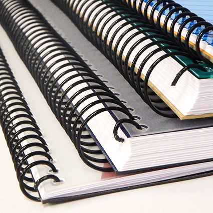

# UNITAT 5: ENQUADERNACIÓ FUNCIONAL

## Utilització de l'enquadernació funcional
   
L'enquadernació és un conjunt d'operacions necessàries per a unir fulls, documents, quadernets o revistes amb una coberta, formant un conjunt unitari de lectura.

El mètode triat en enquadernar ens diu la importància que donem als documents, la durada i el valor que tenen. Així, podem enquadernar amb una sola grapa o cosit amb coberta de pell.

Hi ha moltes tècniques d'enquadernació: el cosit, l'enquadernació adhesiva, el canonet de plàstic, l'espiral, l'enquadernació wire-o, etc.

Abans de decidir quina és l'enquadernació més adequada, tindrem en compte:

* La mida i el nombre dels documents.
* Com s'utilitzaran.
* El cost dels diferents mètodes, en funció del nombre de passos que requereixen.

## Tipus d'enquadernació

Hi ha diferents tipus d'enquadernació. El mètode més senzill és el grapat, adequat per a poques pàgines. Alhora, el grapat pot ser simple (grapa en una cantonada) o amb pàgines plegades i grapades al llom.

### Enquadernació en espiral
   
Aquest mètode consisteix a unir les fulles per mitjà d'una espiral que s'enrosca en unes perforacions circulars prèviament realitzades. Les fulles queden unides per aquesta espiral flexible que s'enrotlla sobre si mateixa.
   
El nombre de fulls a enquadernar és flexible, es pot utilitzar diferents tipus de paper i permet afegir o treure fulls fàcilment després (el mateix avantatge tenen els sistemes de canonet, wire-o i cremallera)

| ENQUADERNACIÓ EN ESPIRAL |  |  |  |
|---|---|---|---|
| Procés | Màquina específica | Material d'unió | Acabat |
| 1. Perforar els fulls  2. Girar l'espiral fins arribar al final del document  3. Tanca els extrems de l'espiral per a evitar que es solten els fulls | Realitza tot el procés d'enquadernació. Per això incorpora un sistema de perforat i una guía d'espiral. Existeixen màquines semiautomàtiques que perforen i col·loquen els fulls. | Espiral metàl·lica o de plàstic. Existeixen diferents espirals de diferents diàmetres segons els fulls. |  |

### Enquadernació de canutet

Forma d'enquadernació mecànica en què les fulles s'uneixen per mitjà d'un espàrrec amb làmines de plàstic, amb aspecte de pinta les pues de les quals s'insereixen en unes perforacions rectangulars realitzades prèviament en el document.
   
L'espiral de plàstic és flexible i s'enrotlla cap a dins deixant enganxades les fulles.

   | ENQUADERNACIÓ DE CANUTET |  |  |  |
|---|---|---|---|
| Procés | Màquina específica | Material d'unió | Acabat |
| 1. Perforar els fulls  2. Obrir l'espiral.  3. Introduir els fulls a l'espiral pels forats.  4. Tancar l'espiral. | Realitza tot el procés d'enquadernació. Per això incorpora un sistema de perforat i altre d'obertura del canutet. | Canutet generalment de plàstic amb obertura de 180º. Existeixen diferents diàmetres depenent del nombre de full a enquadernar. |  |

### Enquadernació wire-o

Aquest sistema d'enquadernació és semblant al de canonet. Les fulles s'uneixen mitjançant un espàrrec de filferro que s'insereix a les perforacions prèviament realitzades. 
   
L'espiral de filferro flexible es tanca al centre, deixant enganxades les fulles.
   
Cal fer servir alicates especials per a espirals metàl·liques per tallar l'espiral sobrant del treball i fixar els extrems per evitar així que se'n surten les fulles enquadernades. L'acabat és similar a un quadern convencional. Els avantatges d'aquest sistema:
   
+ Obertura total de 360° sense deformar-se el llom, tantes vegades com calga.
+ Les pàgines romanen sempre planes.
+ Les pàgines enquadernades coincideixen totes perfectament.
  
| ENQUADERNACIÓ WIRE-O |  |  |  |
|---|---|---|---|
| Procés | Màquina específica | Material d'unió | Acabat |
| 1. Perforar els fulls  2. Introduir l'espiral wire pels forats.  3. Tancar l'espiral wire. | Es necesiten dues màquines: una pera perforar i altra per a tancar el wire. | El wire està modelat en forma tubular. Existeixen diferents diàmetres depenent del nombre de fulls a enquadernar. |  |

  

### Enquadernació tèrmica

Facilita l'arxiu i classificació d'informació utilitzant lloms de diferents colors. Carpetes preencolades unides per cua calenta. S'enquaderna en un sol pas. No cal separar les fulles abans d'enquadernar; totes les fulles es recol·loquen en una sola vegada, evitant que es desordenen.
   
Permet desenquadernar si la resistència del document enquadernat és bona.

| ENQUADERNACIÓ TERMICA |  |  |  |
|---|---|---|---|
| Procés | Máquina específica | Material d'unió | Acabat |
| 1. Engegar la maquina i esperar el procés de calentament  2. Determinar el grosor del dors de les cobertures preencolades.  3. Introduir els fulls a enquadernar i esperar el temps que indique la màquina. | Es necessita corrent elèctrica i una màquina d'enquadernació tèrmica | Carpetes tèrmiques |  |

   

### Enquadernació de cremallera ibiclick
   
Aquest sistema permet obrir i tancar tantes vegades com es desitge i inserir o eliminar fulls en qualsevol moment sense dificultat
   
**Avantatges:**
   
* És funcional: pràctica per a treballs de molt ús, ja que les pàgines poden rotar amb total facilitat 360º.
*  Aplicable a qualsevol mena de feina (personal, oficina, etc.), econòmica i ràpida.
*  Adaptable: es pot augmentar, disminuir o substituir les fulles amb facilitat.
  
**Inconvenients:**
  
  * El nombre de fulles a enquadernar és més limitat (màxim 145 fulls)

| ENQUADERNACIÓ IBIBLICK |  |  |  |
|---|---|---|---|
| Procés | Máquina específica | Material d'unió | Acabat |
| 1. Perforar els fulls  2. Introduir l'espiral ibiclick per les perforacions dels fulls.  3. Tancar l'espiral ibiclick amb l'ajuda del tancador. | Es necesita un o dos maquines: una per a perforar els fulls i altra per a tancar l'espiral ibiclick. PEr a tancar l'espiral ibiclick es pot fer servir el obridor/tancador que normalment es ven amb l'espiral. | Existeixen diferents diàmetres depenent del nombre de fulls a enquadernar. |  |

### Detecció de possibles incidències

!!!warning "Nota"
    Cada enquadernadora pot tenir incidències concretes i cal consultar el manual del fabricant.

## Eines d'enquadernació

Tractarem en aquest apartat els equips que comunament s'utilitzen a les oficines per enquadernar els documents. Al final de la següent relació apareixen altres eines utilitzades a les enquadernacions de tipus professional. S'han assenyalat únicament com a exposició i no per al seu estudi detallat.

* Guillotina o cisalla.
* Grapadora.
* Trepant / Perforadora.
* Plastificadora.
* Destructora de paper.
* Plegadora.
* Màquina de cosir amb fil vegetal.
* Màquina alçadora.
* Fenedora.
* Eines auxiliars.
  
### Cisalles de palanca i de rodet

Conegudes també com a guillotines, serveixen per a tallar documents amb un acabat recte i net. Es componen d'un tauler que inclou una escala mil·limetrada de diferents formats de paper normalitzats, una fulla i un protector de la fulla per mantenir la seguretat al tall. Hi ha diferents models depenent de l'ús i el lloc on seran emprades, segons es mostra a la següent llista:

1. **De sobretaula**: Indicada per a oficines i estudis
2. **De taula**: Per a ús freqüent. Són estables i amplies.
3. **Manual**: L'ajust i la baixada del full tallant són manuals.
4. **Semiautomàtica**: Per a ús professional. Ajust manual i baixada del full tallant automàtica.
5. **Automàtica**: Per a ús professional. Tot el procés és automàtic.
6. **Programable**: Màquina automàtica amb la possibilitat de guardar en memòria les tasques més habituals.

**Mesures de seguretat**
      
Les mesures de seguretat que cal tenir en compte per a evitar accidents perillosos en l'ús d'aquestes màquines són:
* Els propis de l'electricitat a les cisalles automàtiques.
* Protegir el pedal de posada en funcionament per evitar el tall accidental; bloqueig de seguretat.
* Protegir la secció de tall en tots els casos per evitar introduir els dits o la mà sota tall.
  

### Trepants / Perforadores

Preparen els documents per a poder presentar-se en anelles, o com a pas previ abans de fer les enquadernacions de canonet, espiral... Són màquines de gran precisió i seguretat. Permet seleccionar el diàmetre i la distància de les perforacions, així com el nombre de broques.
   
La majoria de les perforadores múltiples, així com moltes d'un sol forat, acumulen el paper sobrant en càmeres per facilitar el reciclatge i l'eliminació de residus. Han de ser periòdicament buidades per poder seguir usant la perforadora.

### Grapadores

La grapadora és el sistema més elemental i de menor cost per unir fulles. Hi ha diferents tipus, que s'utilitzen en funció de:

* Les propietats de la feina a realitzar.
* La rapidesa i el nombre de pàgines que poden arribar a grapar.
* Les característiques de l'usuari (persones amb capacitat reduïda a les mans utilitzen les grapadores elèctriques).

**Grapes i llevagrapes**

Material complementari a la grapadora, utilitzat per unir de forma fàcil i neta fulles.
      
Fabricades en diferents materials segons la seua resistència i en diferents mides segons el model de grapadora que cal utilitzar. S'identifiquen pel nombre (exemples no 10, 24/6, 26/6).
      
Els llevagrapes s'utilitzen per treure les grapes d'un document sense trencar els fulls i amb un esforç mínim.

### Plastificadors

Serveixen per a una protecció duradora de carnets, fotografies, impressions i tota mena de documents. Per això s'aplica un revestiment de material plàstic que cobreix tot el document. En el cas de les enquadernacions funcionals, les plastificadores es poden utilitzar per enfortir la coberta i la contraportada d'un treball realitzat amb enquadernadores de canonet, espiral o qualsevol altre mètode. És un sistema vàlid per a tots els formats. El plastificat es pot fer tant en fred com en calent. Hi ha diversos tipus:

* **De carteres**: plastifica a partir de pràctiques fundes dels formats més estàndard.
* **De bobines**: permeten formats més flexibles i de gran longitud.

### Destructores

   Talla a tires o partícules qualsevol classe de paper. Alguns models ofereixen la destrucció de grapes, CD i clips. Proporcionen una gran seguretat en impedir la reconstrucció d'aquells documents confidencials, l'ús i la conservació dels quals ja no és necessària.

### Eines auxiliars

* Eines per muntar i desmuntar conjunts intercanviables: llevagrapes, tancador a l'enquadernació ibiclick, etc.
* Eines específiques per al manteniment preventiu.
* Eines convencionals: alicates, cutter, etc.

## Materials d'enquadernació
### Paper

Hi ha molts fabricants i distribuïdors de diferents tipus i marques de paper:

* ***Paper offset:*** és el paper més utilitzat en fotocopiadores, impressores làser, etc. Tenen una mena de “pelussa”. Es comercialitza en una gran gamma de colors a més a més del blanc. Molt utilitzant com a paper de carta, sobres, interiors de llibres, etc.
  
* ***Paper estucat:*** és el paper que s'utilitza habitualment per a revistes, catàleg i fulletons. És brillant, sense la “pelussa” del paper òfset. Per ells no es recomana per escriure a sobre, ja que la tinta rellisca. Té dos acabats: estucat brillant i mat.
  
* ***Paper ecològic:*** a causa de la degradació constant de l'ecosistema i a les normes que preveuen la protecció del medi ambient, cada cop està més generalitzat l'ús d'aquest tipus de paper. Es tracta d'un paper fabricat amb les deixalles d'un altre. Té un cert color, encara que actualment, el blanc està cada cop millor aconseguit.

### Material per a tapes i contraportades

Aquests materials es troben també en qualitats i classes molt diferents. Poden ser rígids o flexibles depenent de la utilitat que se li done a l'enquadernació. Entre els més utilitzats trobem:

* ***Cartró:*** pot ser granulat, brillant o amb efecte pell i la qualitat depén dels gr/m.
  
* ***Cartolines:*** gran varietat de colors. La qualitat depén del gruix mesurat en mil·límetres.

* ***Pell orgànica de boví o cobra:*** per enquadernar fascicles o documents importants i duradors, com ara llibres de col·lecció.

* ***Laminats:*** generalment és una tapa dura de cartró recoberta amb un folre per protegir-lo. Els laminats són brillants amb efecte envernissat.

* ***Cobertes de PVC:*** protegeixen el primer full o la contraportada i si són transparents permeten visualitzar la portada del document enquadernat.

* ***Coberta de roba:*** tapa dura que inclou material teixit.

* ***Paper d'arròs i altres papers vegetals:*** donen un aspecte artesanal als treballs d'enquadernació.

* ***Tapes plastificades:*** de paper de bona qualitat i gran gruix al que s'ha plastificat servint de tapa per a les enquadernacions.

* ***Plastificats de polipropilè:*** productes termoplàstics reciclables, no contaminants i de poc impacte ambiental.

* ***PVC plàstic:*** el seu alt contingut en clor i additius el converteixen en un verí per a la salut i el medi ambient en tot el cicle de vida.

## Utilització d'equips i eines en condicions de seguretat

En aquest punt es recullen algunes de les recomanacions més generals per al correcte ús de les eines d'enquadernació

### Condicions de seguretat

1. Utilitza la màquina únicament per a la finalitat segons les indicacions del fabricant.

2. No col·loqueu res en l'obertura de perforació de la màquina que no sigui el paper i el material de les tapes.

3. Col·loca la màquina en una àrea segura i estable de treball per impedir que la màquina caigui danyant-se i causant lesions personals i danys materials.

4. Aneu amb compte en realitzar els primers forats amb la màquina, les fulles poden tenir greix.

5. Assegureu-vos que els documents no contenen grapes, clips i altres objectes aliens al paper del document.

6. Has de buidar el recipient de deixalles amb regularitat; si no és així, començaran a sortir per altres ranures de la màquina i provocaran un embús.

7. Trepant sempre amb la palanca a la posició superior.

!!! danger "Important" 
    A l'hora d'utilitzar les màquines i les eines d'enquadernar s'han de tenir en compte les instruccions facilitades per cada fabricant

### Mesures preventives en aparells elèctrics

1. Pren precaucions bàsiques per evitar el risc de descàrrega elèctrica.

2. No manipules aparells elèctrics trepitjant terra mullat.

3. Desendolleu la màquina quan no l'estigueu utilitzant i per netejar-la.

4. No poseu la màquina en funcionament amb un cable o endoll danyat. Si l'endoll queda fluix, es produeix un arc elèctric que pot fer que es reescalfe arribant fins i tot a cremar-se.

5. No introduïu cap objecte metàl·lic (tisores, clips...) a les zones d'entrada o sortida.

6. No plastifiques objectes metàl·lics.

7. Instal·la la màquina en un lloc accessible i proper a la presa de corrent.

8. No has de submergir el cable, els endolls o l'aparell elèctric a aigua ni en qualsevol altre líquid.

9.  No neteges la màquina amb netejadors abrasius.

10. No connectes molts aparells a un mateix endoll, ja que es pot reescalfar si no s'està preparat per a aquesta potència.

## Eliminació de residus

En primer lloc haurem d'esbrinar si una substància determinada és un residu i fer-ne la classificació segons la normativa vigent a través d'un procés d'anàlisi. Així, coneixerem les característiques específiques de cada residu i podrem fer un tractament adequat per respectar el medi ambient.

Els residus produïts per l'activitat del sector de les arts gràfiques es classifiquen en funció de la seua perillositat i la fase de producció en què són produïts a: residus perillosos i residus no perillosos.

Pel que fa als residus perillosos, els productors han d'observar una sèrie d'obligacions quant a l'envasament, l'etiquetatge i l'emmagatzematge.
Per a la seua eliminació poden, o bé lliurar-se a un
eliminació segura, o bé gestionar-los la pròpia
necessari obtenir autorització.
La resta de residus que tenen la consideració de no perillosos seguiran les normes i les condicions d'eliminació i reciclatge que determinin les entitats locals comunes per a tots els ciutadans (reciclat d'envasos, restes de plàstics que no hagin contingut matèries perilloses, paper, etc.) .
A continuació es descriuen els tipus de residus resultants dels principals processos productius:

### Tipus de residus perillosos

* Restes de tintes, dissolvents, restes de reveladors, cautxús emprats entre el paper i la tinta, planxes de cautxú, polímers, solucions de gravat, motlles, etc.

* Restes d'adhesius, guants, màscares usades i impregnades de substàncies perilloses i draps impregnats de dissolvents orgànics procedents de la neteja de les màquines.

* Paper d'impressions rebutjades procedents de tractament d‟aigües.

* Restes de pel·lícula, paper fotogràfic, restes de solucions fixadores, contenidors de productes químics buits.

* Piles i bateries: han de ser dipositades en contenidors especials perquè són molt contaminants.

### Tipus de residus no perillosos

* Paper rebutjat d'impressions rebutjades.

* Restes procedents del tall i embalatge (cartró, paper plàstic, etc.).

* Són assimilables a residus urbans.

### Mesures per a minimitzar l'impacte dels residus 

* Separació i reciclatge de paper: generats per restes d'embalatge, paper, retallades i pel·lícules generades a l'etapa fotomecànica.

* Aprofitament de la tinta a l'etapa d'impressió: els excedents de tinta es poden fer servir per a fer barreges.

* Parar atenció als olis mitjançant tècniques de prevenció-minimització: ampliar la vida dels olis i utilitzar olis sintètics.

* Disminuir l'ús de paper: imprimir només allò necessari per evitar l'ús excessiu de tinta i paper (sobretot en el cas dels correus electrònics).

* Fotocopiar a doble cara o reduir i comprimir per estalviar paper.

* Apilar el paper usat en safates i reutilitzar-lo si és possible com a bloc de notes.
